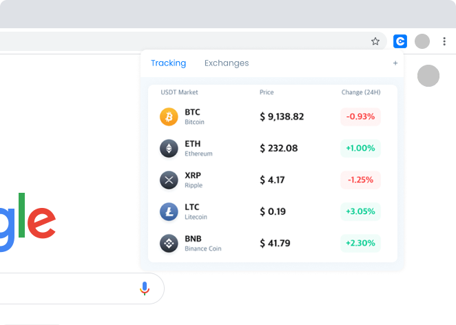

<h1 align="center">
   
  
   
  Cryfo
   
</h1>

<h4 align="center">A minimal extension to see infos about your favorites cryptocurrencies directly on browser.</h4>

    
    

  <a href="#key-features">Key Features</a> •
  <a href="#how-to-use">How To Use</a> •
  <a href="#download">Download</a> •
  <a href="#credits">Credits</a> •
  <a href="#related">Related</a> •
  <a href="#license">License</a>

## Key Features
---
* Save Cryptos
  - Select your prefered cryptocurrencies and fast see their status.
* Available Exchanges
  - Get a list of all exchanges that trade your cryptos.
* Real-time status for each data
* No login required, all data saved locally.

## How To Use
---
- Install extension on your browser.
- Access the extension options and add your prefered coins to follow.

## Download
---
You can [download](#update-link) the latest installable version extension for Chrome or Firefox.

## Credits
---
This software uses the following technologies:

- [Chrome Extension](https://developer.chrome.com/docs/extensions)
- [CoinGecko](https://www.coingecko.com/en/api)

## License
---
[MIT](./LICENSE)

> [segredo.dev](https://segredo.dev) &nbsp;&middot;&nbsp;
> GitHub [@iaurg](https://github.com/iaurg)

